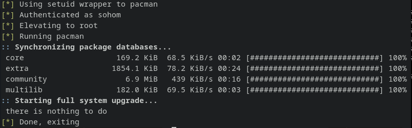

# pacman-nopass

A solution to having to type `sudo` and enter the password everytime I try to update/install a package.

## Installation

- Git clone this repo
- Run `make`
- Alias pacman to pacman-nopass in your profiles file (Add `alias pacman=pacman-nopass` to `~/.bashrc`)

## Demo

